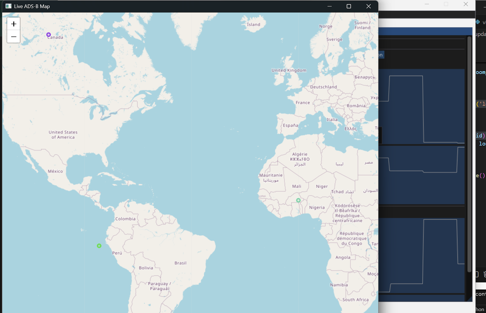

# ADS-B Multi-Feed Dashboard

A **real-time ADS-B aircraft tracking dashboard** built with Python, featuring a multi-feed plane data viewer and a live interactive map. Designed for testing and visualization of simulated ADS-B data streams, it combines **Pygame + PyImgui** for the dashboard interface and **PyQt6 + Folium** for the map display.

## Features

* **Simulated ADS-B feed** for testing with fake plane data (callsign, latitude, longitude, altitude, velocity, timestamp).
* **Real-time dashboard** with plane selection, statistics, and fixed-size plots:

  * Altitude
  * Velocity
* **Interactive map** displaying aircraft positions:

  * Each plane assigned a unique color
  * Markers update in near real-time without flickering
  * Map recenters smoothly only if planes move significantly
* **Auto-select top N planes** or manually select planes to display plots.
* **Clean UI layout** using columns: left panel for plane list, right panel for plots.
* **Menu options** for opening the map, refreshing it, or quitting the dashboard.

## Installation

```bash
pip install pygame PyOpenGL imgui[full] PyQt6 PyQt6-WebEngine folium numpy
```

> Ensure Python 3.10+ for compatibility with PyQt6 and multiprocessing.

## Usage

```bash
python dashboard_adsb.py
```

* The dashboard window will open, showing live plane data plots.
* Open the map from the **File → Open Map** menu.
* Plane markers are colored uniquely for easier tracking.
* Use **Auto-select top 3** to quickly view the most recently updated planes.

## Notes

* The map update frequency is reduced and recenters only when necessary to avoid flickering.
* Supports up to 500 planes for performance testing.
* Designed as a **testing prototype**—can be integrated with real ADS-B feeds or extended with live data.

## Screenshots

ADS-B Dashboard:


Live Map:


