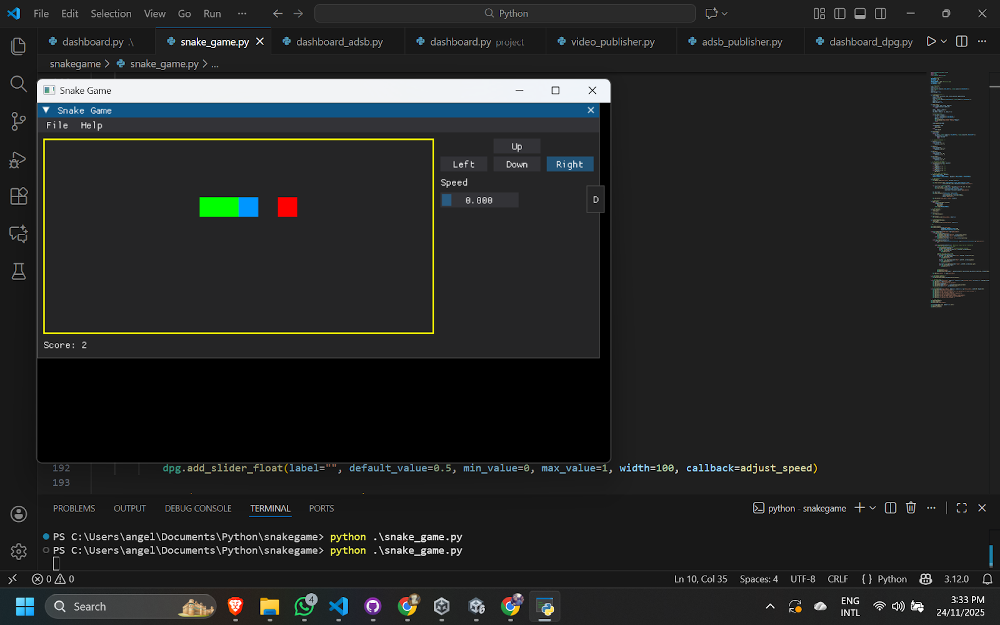
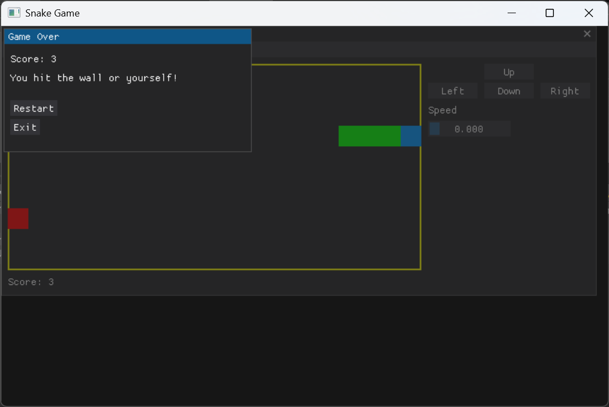
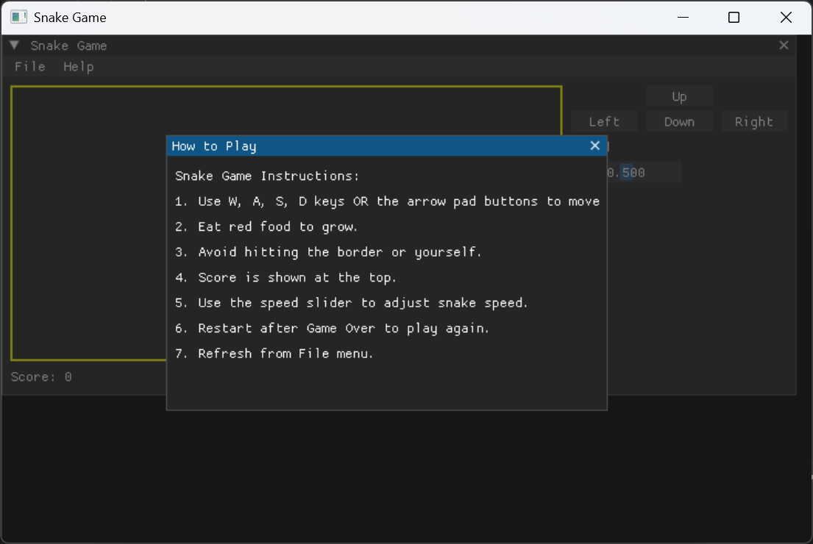

# Snake Game with DearPyGUI 🐍

[](LICENSE)

A simple Snake game built in Python using [DearPyGUI](https://github.com/hoffstadt/DearPyGui).  
Control the snake using **WSAD keys** or the **on-screen arrow pad**. Adjust the snake speed with a slider.

---

## Features

- Classic Snake gameplay:
  - Eat red food to grow.
  - Avoid hitting walls or yourself.
- Controls:
  - **Keyboard:** W (up), A (left), S (down), D (right)
  - **Arrow pad:** On-screen buttons arranged like a keyboard arrow pad.
- Speed adjustment with a slider (0 = slow, 1 = fast)
- Score display
- Game Over popup with option to restart
- Fully responsive arrow pad aligned visually like a real keyboard

---

## Screenshots


Game:



Game Over:



How To Play:



---

## Installation

1. Make sure you have Python 3.10+ installed.
2. Install dependencies:

```bash
pip install dearpygui
